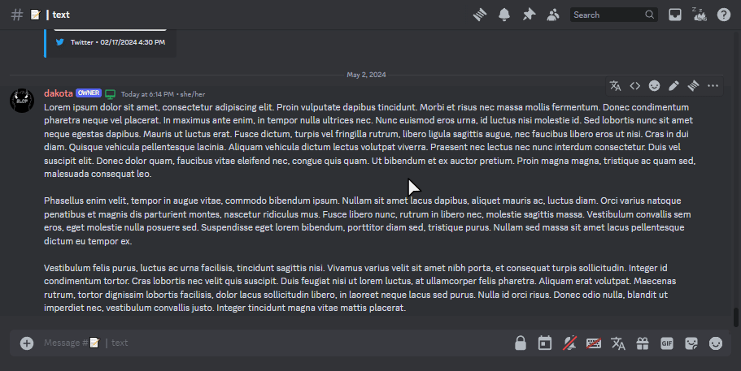
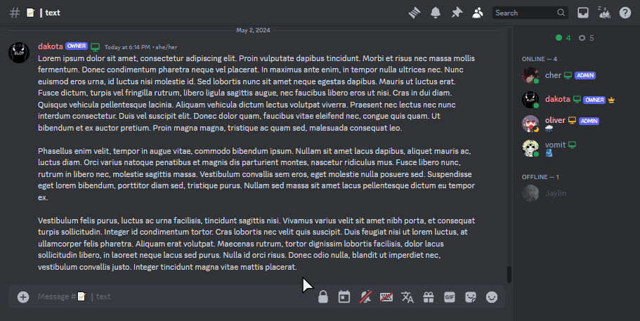

# Hoverable-Discord-Theme
### Hoverable Sidebars for a more compact discord.

## Installation
Vencord

### Local
1. Go to User Settings -> Vencord -> Themes -> Local Themes
2. Click Open Themes Folder
3. Download the CSS file below
```
https://kota.is-a.dev/Hoverable-Discord-Theme/collapse.theme.css
```
4. Drop the file into the "themes" folder
5. Click Load Missing Themes
6. Find the theme and turn it on

### Online
1. Go to User Settings -> Vencord -> Themes -> Online Themes
2. Add below URL to Online Themes section
```
https://kota.is-a.dev/Hoverable-Discord-Theme/collapse.theme.css
```

### BetterDiscord
1. Go to User Settings -> BetterDiscord -> Themes
2. Click Open Themes Folder
3. Download the CSS file below (Until this is up on BetterDiscord)
```
https://kota.is-a.dev/Hoverable-Discord-Theme/collapse.theme.css
```
4. Drag the file into that folder.

## Screenshots

